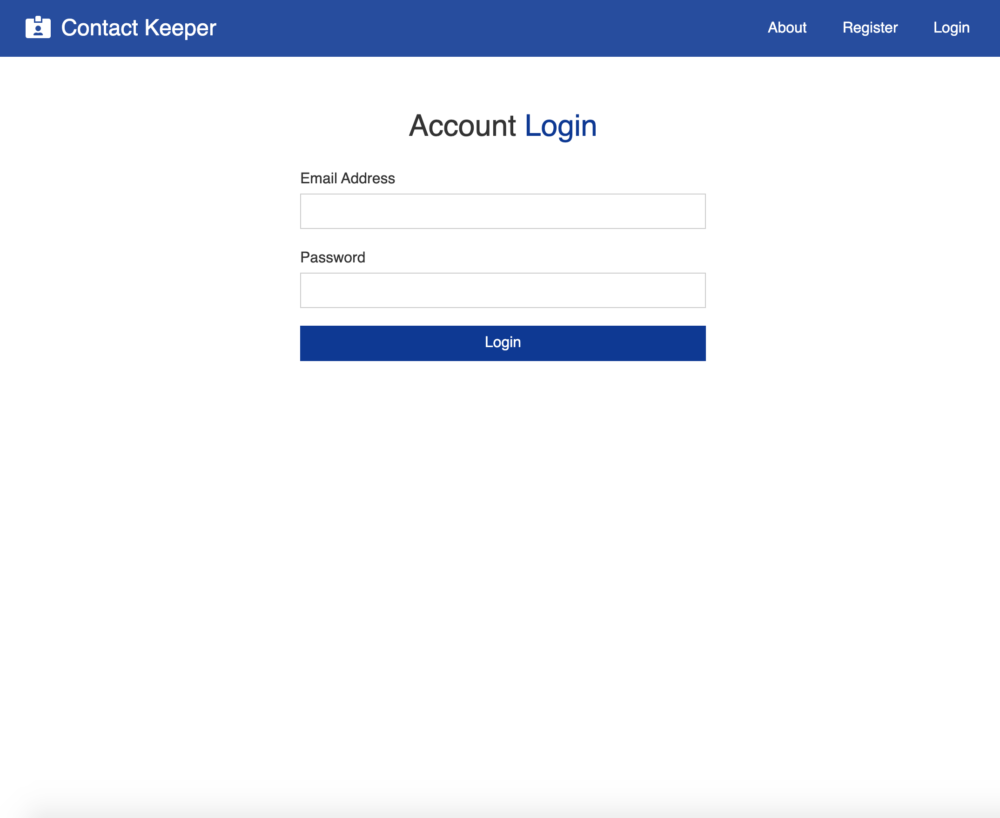

# Contact Keeper

## Description

### Contact Keeper is a fullstack app created with MongoDB, Express, React and Node.

On this app users can:

-   Create a private account.
-   Add, Edit and Delete contacts.

## Prerequisites

-   [NPM](https://www.npmjs.com/get-npm)
-   [NodeJS](https://nodejs.org/en/)
-   [MongoDb Atlas Account](https://www.mongodb.com/blog/post/quick-start-getting-your-free-mongodb-atlas-cluster)

## Installation

-   `Create account with MongoDb Atlas and create your cluster to connect this application with.`
-   `Once created, from the root folder, click into 'config' folder`
-   `Once in the config folder, open the 'default.json' and 'production.json' files and update the mongoURI code with your own code.`

After above steps are completed, on your command line, run the following commands:

-   `Git clone git@github.com:pablomotta/burger-CRUD-APP.git`

-   `npm install`

-   `npm start`

## Author

-   **Pablo Motta** - [github profile](https://github.com/pablomotta)

## Live App

[Click here to visit the live website.](https://contact-keeper-pm.herokuapp.com/)
